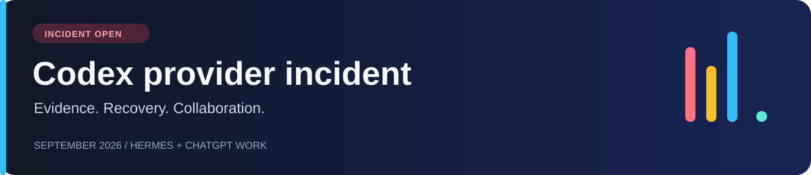

# Codex provider incident · September 2026

**Goal: restore sustained, reliable Codex-backed Jarvis operation through Hermes on the affected existing subscriptions.**

> [!WARNING]
> **Incident continuity note — no final closure has occurred.** The short usable interval around 11–12 September was temporary partial relief, not a durable recovery. Subsequent recurrence superseded the earlier optimistic closure language and the incident remains open.

We refer to the company as **the provider** throughout the investigation. Product names, technical identifiers, source URLs and verbatim evidence retain their exact spelling for reproducibility.

[Русская сводка](docs/README.ru.md) · [Evidence](evidence/README.md) · [Recovery procedure](docs/RECOVERY.md) · [Open tasks](https://github.com/gv1983us-commits/codex-provider-incident/issues) · [Hermes report](https://github.com/NousResearch/hermes-agent/issues/107307)

> [!CAUTION]
> **17 September, evening continuation — normal work is still blocked.** Exact-prefix log extensions add **33 failed Sol attempts** and four request IDs; despite **24 successful inner Codex calls**, two Hermes user turns still ended as overload errors after **986.2 s** and **503.0 s**. Current reconciliation: **723** failures since the fixed baseline, **954** across supplied logs, and **498** in the final rolling 48 hours.
>
> A strict extension of the public Direct ChatGPT graph confirms a **third incomplete Sol turn lasting at least 2:50:04.815**, bringing the three non-overlapping lower-bound Direct ChatGPT windows to **8:13:14.678**. Hermes also emitted seven consecutive local WebSocket `loop stalled >10s` warnings. [Evening report](docs/EVENING-CONTINUATION-2026-09-17.md) · [Hermes delta](evidence/log-extension-20260917-late.json) · [Direct graph receipt](evidence/direct-chatgpt-share-extension-20260917.json).

> [!IMPORTANT]
> **17 September — incident remains OPEN across Hermes/Codex and owner-visible direct ChatGPT Pro Light.**
>
> The extended Hermes audit adds **397 failed attempts**, all on `gpt-5.6-sol-900k`: **690** since the fixed 10 September baseline, **921** across all supplied logs, and **465** in the final rolling 48 hours. It also adds **27 GUI error turns**, **30 complete 5/5 chains**, **86 request IDs**, and three further 5/5 overload chains on 17 September. In the same coverage, 826 successful calls coexist with failures; short success is not sustained recovery.
>
> Separately, the public Direct ChatGPT shared-session graph confirms two incomplete turns on `gpt-5.6-sol-wm`: **1:51:00.368** in the morning and **3:32:09.495** in the afternoon. Each contains a partial model node followed by empty non-final nodes and **no `end_turn=true` before the next user message**. The share exposes no provider request ID, HTTP result or hidden retries, so these cases remain separate from the 397 Hermes failures. Pro Light/Yandex attribution is owner-supplied context. [Session-graph report](docs/DIRECT-CHATGPT-SHARE-TIMING-2026-09-17.md) · [Minimized receipt](evidence/direct-chatgpt-share-timing-20260917.json) · [Hermes cross-surface report](docs/CROSS-SURFACE-RECURRENCE-2026-09-17.md).

> [!IMPORTANT]
> **16 September — incident remains OPEN.** The owner still cannot work normally and requests joint repair by Hermes maintainers and the provider.
>
> **Through 16 September 09:06:01 UTC+3: 255 failed Codex attempts in the rolling 48 hours; 277 since the original Git baseline.** The new logs add **99 Astra failures and nine GUI error turns**. Both sessions exhausted **five attempts** around 09:04; GUI errors were **1.532 s apart**. [Morning recurrence and full report](docs/MORNING-RECURRENCE-2026-09-16.md) · [New ledger and source hashes](evidence/log-extension-20260916T060601Z.json).

The earlier temporary-recovery claim was followed by [recurrence on 12 September](https://github.com/gv1983us-commits/codex-provider-incident/issues/1#issuecomment-5643482050). That brief usable interval did **not** close the incident; individual successful runs have not established a durable fix.

## Earlier updates — 10 September

> [!NOTE]
> **Latest owner follow-up:** roughly five failures with shrinking usable intervals, ending in immediate failure; Hermes/Codex is now unusable for the owner. This is an approximate narrative, not five additional audited receipts. [Fresh community comparison](docs/COMMUNITY-FOLLOWUP-2026-09-10.md) finds similar temporary recovery and renewed failures across several clients, with conflicting workaround outcomes.
>
> **Latest exact receipt: Pro Light also returns Sol overload.** The [15:21:54.745 UTC receipt](docs/LIGHT-OVERLOAD-2026-09-10.md) names `gpt-5.6-sol-900k / overloaded`; the owner identifies Light. Both accounts now have reported Hermes/Codex failures. Light allowed conservation but is not a sustained workaround.
>
> **Earlier: the same large Builder session resumed in Hermes after switching to Pro Light.** The owner now reports **Sol completed conservation to `QUIESCED_SAFE`**. The later Astra banner was identified as old; no new Sol failure is counted. [Completion and banner correction](docs/CONSERVATION-2026-09-10.md). This is temporary continuation on another account. **Pro Full remains unresolved.** [Account-switch evidence and reset ledger](docs/ACCOUNT-SWITCH-2026-09-10.md).
>
> **Earlier: Astra continuation also failed.** After the confirmed **Astra 900k / Medium five-tool success at 12:18:50 UTC**, the owner reports approximately ten further tool calls followed by a provider error. The [new exact receipt](docs/ASTRA-2026-09-10.md) records **14:17:45.876 UTC / `gpt-6-astra-900k` / `code: unknown`**, with a request ID. This is separate from the earlier GPT-5.5 `overloaded` receipt. No sustained recovery is demonstrated; the failed call's effort is not supplied.

## Account / route observations — 10 September snapshot

| Account | Client / route | Model | Latest reported observation |
| --- | --- | --- | --- |
| Pro Full 20× | Hermes → Codex, earlier tests | Astra / Sol / Terra | 🔴 Earlier overloads; later Astra Medium success recorded below |
| Pro Full 20× | Hermes → Codex, audited short turn | Astra 900k / Medium | 🟡 Text + five-tool turn completed at 12:18:50 UTC |
| Pro Full 20× | Hermes → Codex, subsequent owner report | Astra 900k; current effort not supplied | 🔴 `unknown` provider error at 14:17:45.876 UTC; request ID retained |
| Pro Full 20× | Official ChatGPT Work | GPT-6 / GPT-5.6 | 🔴 Capacity banner |
| Pro Full 20× | Official ChatGPT Work | GPT-5.5; Max in latest report | 🟡 Earlier response; latest report very slow; no new browser failure established |
| Pro Full 20× | Hermes → Codex, new session | GPT-5.5, Ultra selected | 🔴 Initial activity, then overload; provider/model confirmed by receipt |
| Pro Full 20× | Ordinary ChatGPT Conversation | Model not recorded | 🟢 Conversation works |
| Pro Light | Official ChatGPT Work, earlier comparison | Exact model not recorded | 🟢 Earlier Work comparison passed; no new browser failure established |
| Pro Light | Hermes → Codex, same Builder session during conservation | Sol, owner-reported; exact request settings not supplied | 🟡 Conservation reported complete to `QUIESCED_SAFE`; later failure recorded below |
| Pro Light, owner attribution | Hermes → Codex, latest receipt | `gpt-5.6-sol-900k` | 🔴 `overloaded` at 15:21:54.745 UTC |

**Controls:** the same home Windows laptop, network and VPN; both Edge and Yandex tested; ChatGPT's built-in account switcher used in Yandex. The Full-account browser failure persists with Hermes shut down. Pro Light worked in the earlier comparison and completed conservation, but a later Hermes receipt records Sol overload on Light as well.

This narrows the failure to an **account/model/route-dependent pattern**. It does not identify an internal server pool, prove an account restriction, or establish the exact server-side cause. A short-prompt test in a fresh Work conversation on the affected account is still useful to separate conversation state from model/account routing.

The [new exact receipt](https://github.com/gv1983us-commits/codex-provider-incident/issues/1#issuecomment-5618436481) supersedes the initial optimistic GPT-5.5 Hermes report. It is recorded separately from the historical audit counters. The new export supplies message-level timings below; the cause of the earlier reported slowness is not isolated.

**New evidence:** [29-message session review](docs/SESSION-2026-09-10.md) and [reviewed event data](evidence/session-20260910-reviewed.json). Astra's five-tool analysis finished in **51.33 s**. Earlier delays include **32.50 s inside `hermes doctor`**; the comparison does not isolate reasoning effort as the cause.

## Historical audit — 8–10 September

| Finding | Scope |
| --- | --- |
| **151** main-loop overload failures | Deduplicated across eight session IDs: 102 Sol, 49 Astra |
| **11** auxiliary overload failures | Includes two failed context summaries |
| **3 attempts total** | Observed retry budget; no infinite rotation demonstrated |
| **1,987** successful Codex calls | Detailed log window, 9 Sep after 15:56 through 10 Sep 10:40:37, UTC+3 |
| **41%** weekly allowance remaining | Snapshot at 10:33 on 10 Sep, UTC+3; not a universal quota clearance |
| **850 → 82**, **328 → 102** messages | Active histories shortened after summary generation failed |

The counts have different scopes. **Do not compute an overall incident failure percentage from this table.** Earlier logs do not contain a complete record of successful calls. Terra is a later owner observation; it is not part of the historical 151 Sol/Astra count.

## Joint upstream action requested — 16 September

| Requested party | Required work | Evidence / acceptance |
| --- | --- | --- |
| Provider | Correlate the supplied request IDs, timestamps and models; identify and remediate repeated overload/request-processing failures and investigate connection failures on the Codex route. | A concrete finding and remediation status tied to the supplied receipts. |
| Hermes maintainers | Investigate retry exhaustion, redirect termination, failed compression/approval, history-version rejection and the WebSocket limit; preserve completed tool results and make interrupted state explicit. | A supported upstream fix or documented handling, with safe continuation and no uncontrolled replay of completed tools. |
| Hermes + provider together | Trace the failing request → retry → tool/result → continuation path across both layers and agree on a supported fix. | Sustained useful work on the affected setup, with observation duration and remaining failures reported; successful one-shot calls alone do not close the incident. |

The owner has found no working fix locally. The request is for a supported correction by Hermes and the provider, with sustained practical operation as the recovery criterion. [Current status and evidence](docs/MORNING-RECURRENCE-2026-09-16.md).

## Earlier recovery investigation plan — 10 September

1. **Recover a usable route.** GPT-5.5 also has a confirmed Codex overload receipt. Preserve that failure and require a complete model → tool → model cycle plus sustained useful progress before declaring any route recovered.
2. **Make routing consistent.** Inspect the live main model, explicit workers, auxiliary jobs, compression and fallback targets. A browser response or a changed dashboard default does not prove these routes changed.
3. **Preserve work through rejection.** Investigate retry exhaustion, safe resumption after completed tools, and compression commits when the new summary fails.
4. **Share a reproducible case.** Pin the installed Hermes revision and relevant customizations, then compare a small reproduction with upstream behavior.

The procedure and acceptance criteria are in [RECOVERY.md](docs/RECOVERY.md). No recovery patch has been deployed from this repository.

## Active tasks

| Task | Current owner / invitation | Status |
| --- | --- | --- |
| [#1 · Validate sustained Codex work](https://github.com/gv1983us-commits/codex-provider-incident/issues/1) | Hermes maintainers + provider requested; owner supplies evidence | OPEN as of 18 Sep; latest audited boundary is 17 Sep with 723 post-baseline failures; normal work remains disrupted |
| [#2 · Preserve continuation after retry exhaustion](https://github.com/gv1983us-commits/codex-provider-incident/issues/2) | `huklaa` invited; formal assignment pending | Awaiting contributor confirmation |
| [#3 · Check compression failure and recovery](https://github.com/gv1983us-commits/codex-provider-incident/issues/3) | Account owner coordinates; help wanted | Installed revision and code review needed |
| [#4 · Compare results with Sub2API](https://github.com/gv1983us-commits/codex-provider-incident/issues/4) | Reopened after recurrence; external comparison remains relevant | OPEN; temporary 11 Sep relief was superseded by renewed failures |

The [invitation and repository handoff](https://github.com/NousResearch/hermes-agent/issues/107307#issuecomment-5618225579) are posted in the original Hermes thread. These are coordination states, not completed recovery checks.

## Start here

| Material | Purpose |
| --- | --- |
| [Direct ChatGPT shared-session timing — 17 September](docs/DIRECT-CHATGPT-SHARE-TIMING-2026-09-17.md) | Two incomplete Sol turns confirmed from message topology and `end_turn` state; 1:51:00 and 3:32:09 lower-bound windows |
| [Cross-surface recurrence — 17 September](docs/CROSS-SURFACE-RECURRENCE-2026-09-17.md) | 397 added Hermes/Sol failures, 30 complete 5/5 chains, compression controls and separately scoped Direct ChatGPT evidence |
| [Morning recurrence — 16 September, 09:06 UTC+3](docs/MORNING-RECURRENCE-2026-09-16.md) | Current 277/255 counts; 99 added failures; five-attempt exhaustion, morning comparison and pending-tool / GUI mismatch |
| [Expanded logs — 15 September, 10:16 UTC+3](docs/LOG-EXTENSION-2026-09-15-1016.md) | Earlier 178/157 counts, 60 added Astra failures, near-simultaneous errors and fresh-session failure |
| [Continuing incident — 15 September, earlier 08:32 snapshot](docs/CONTINUING-INCIDENT-2026-09-15.md) | Earlier 08:32 snapshot, 48-hour / after-Git counts, exact final failures and joint repair request |
| [Audited logs — 15 September, earlier 08:32 snapshot](evidence/log-audit-20260915.json) | All 118 Codex attempts, 1,013 diagnostic index entries, selected excerpts and source hashes |
| [Fresh community follow-up](docs/COMMUNITY-FOLLOWUP-2026-09-10.md) | 10 Sep evening: shrinking work intervals, related user reports, temporary recovery and conflicting workarounds |
| [Latest Light overload](docs/LIGHT-OVERLOAD-2026-09-10.md) | Sol `overloaded` on Light after reported conservation; failures now span both accounts |
| [Conservation result and stale banner](docs/CONSERVATION-2026-09-10.md) | Sol completion reported; old Astra receipt redisplayed, no new failure counted |
| [Same-session account switch](docs/ACCOUNT-SWITCH-2026-09-10.md) | Builder resumes on Light, owner-reported; Full unresolved; scoped reset ledger |
| [Latest Astra failure](docs/ASTRA-2026-09-10.md) | Exact `unknown` receipt with request ID; later continuation failure |
| [Incident report](docs/INCIDENT.md) | Controlled comparison, chronology and known limitations |
| [Fresh-session review](docs/SESSION-2026-09-10.md) | GPT-5.5/Sol attempts, later Astra Medium tool success and measured intervals |
| [Controls → requests](docs/REQUEST-MAP.md) | Source-based model/effort mappings and the next bounded recovery observation |
| [One-month public chronology](docs/MONTH-2026-08-10--2026-09-10.md) | 10 Aug–10 Sep: provider incidents, reset events and GitHub compatibility/recovery changes; Russian report with English handoff |
| [Evidence guide](evidence/README.md) | Provenance and how to request a focused excerpt |
| [Exact excerpts](evidence/excerpts.json) | Historical log fields, a screenshot transcription and the new GPT-5.5 receipt |
| [Audit summary](evidence/audit-summary.json) | Counts and the final interruption sequence |
| [Route matrix](evidence/route-matrix.json) | Machine-readable observations, with unknowns preserved |
| [Recovery procedure](docs/RECOVERY.md) | Small tests, route coverage and completion criteria |
| [Contributing](CONTRIBUTING.md) | Report a result, investigate a code path, or propose a patch |

## Join the investigation

- **Have the same symptom?** [Submit a comparable observation](https://github.com/gv1983us-commits/codex-provider-incident/issues/new?template=observation.yml). Record the exact model, route, timestamp, account tier and outcome.
- **Can help with Hermes?** Pick a focused [open task](https://github.com/gv1983us-commits/codex-provider-incident/issues), say what you will investigate, and propose a small PR or diagnostic.
- **Have a working route?** Distinguish a text response from a successful tool loop and sustained work.

Coordination with Hermes remains in [NousResearch/hermes-agent#107307](https://github.com/NousResearch/hermes-agent/issues/107307). A related independent user-report thread is [Wei-Shaw/sub2api#6739](https://github.com/Wei-Shaw/sub2api/issues/6739); reports there are corroborating observations, not proof of a shared root cause.

This is an independent incident repository maintained by the affected account owner. English material was prepared with AI assistance from owner observations and retained audits. It contains a public evidence subset; full private sessions and Jarvis architecture are outside its scope.
